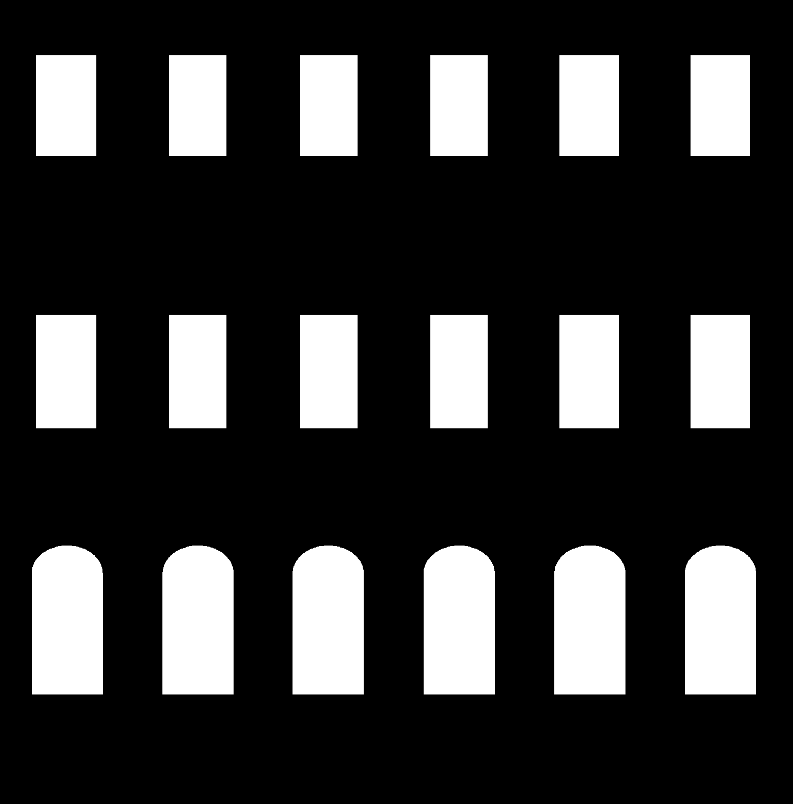
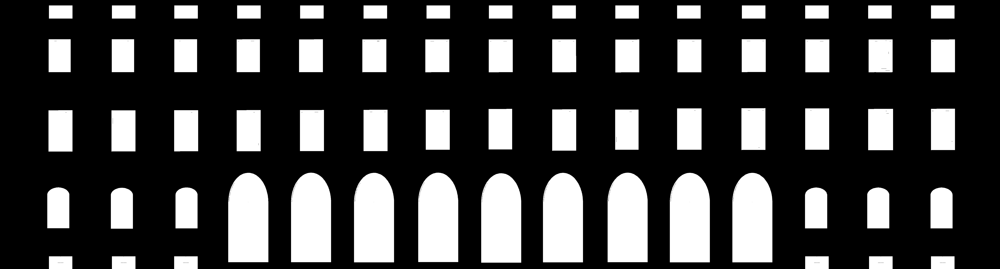
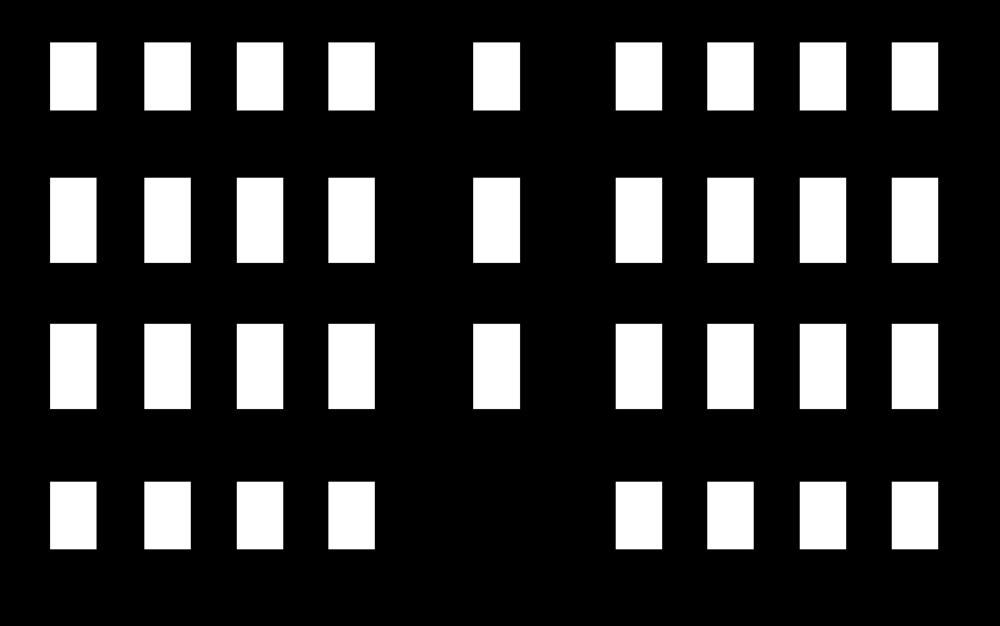
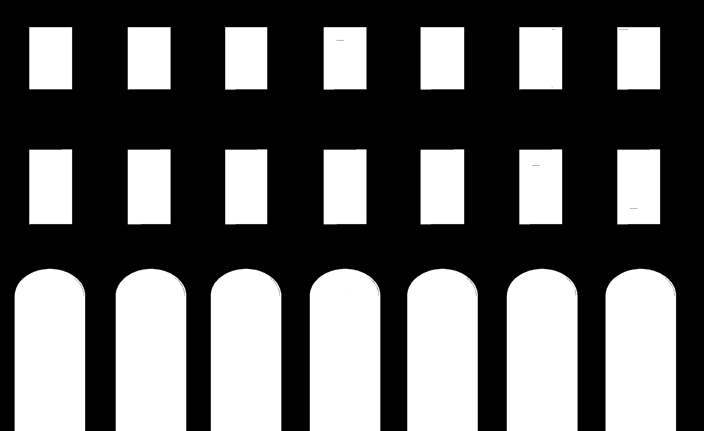
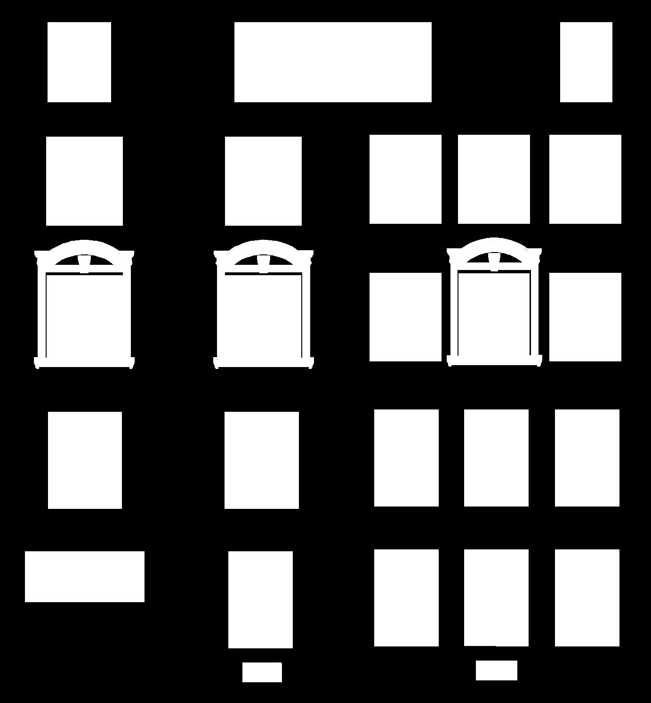
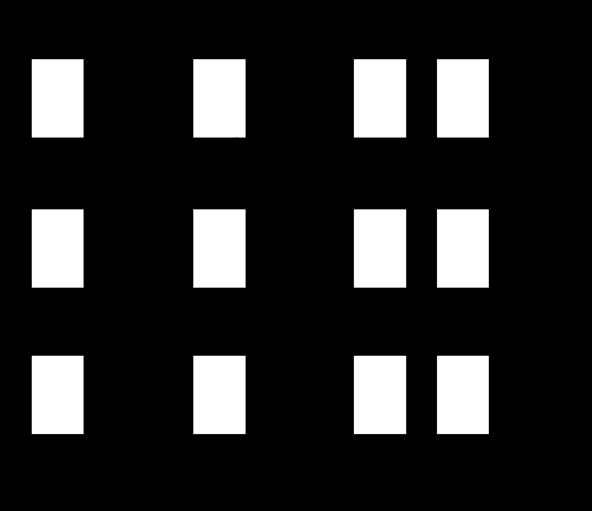
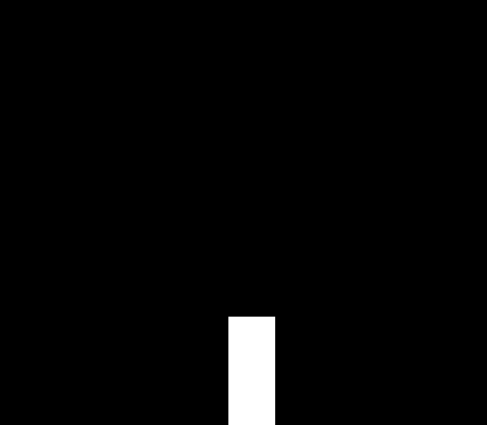
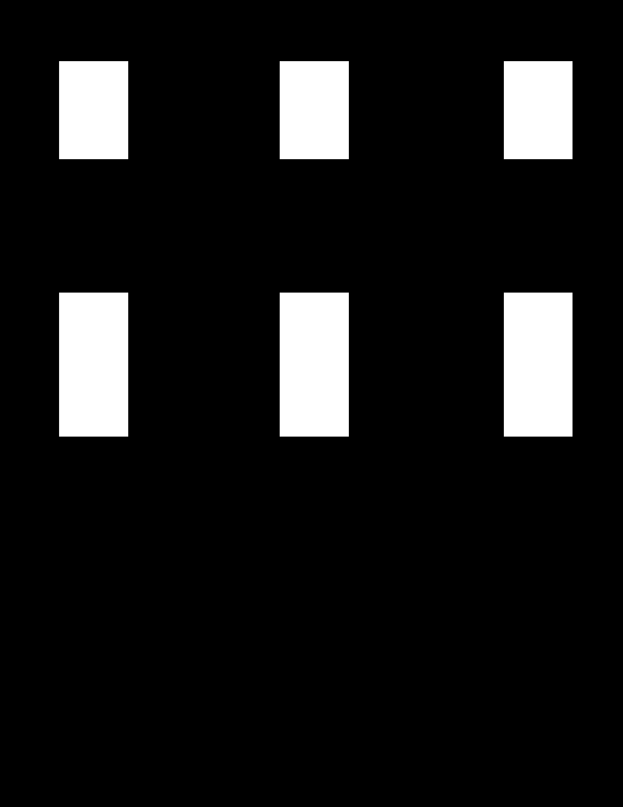

# CityGML Mask Extraction

A lightweight Python tool to extract 2D binary mask images of building façades (with window/door openings) from a CityGML file.

## Environment Setup

We use a conda environment, run:

```bash
conda env create -f environment.yml
```

```bash
conda activate lod3-mask-extraction
```
## Running the Script

To run the tool, first place your CityGML file in the `data` folder, then execute a command similar to:
```bash
python run_extract.py --input data/DEBY_LOD3_4959323.gml --output example_output/
```


**Example Output GT Masks** 

<div align="center">

<table>
  <tr>
    <td align="center">
      <br>
      4906972
    </td>
    <td align="center">
      <br>
      4959323
    </td>
    <td align="center">
      <br>
      4907507(windows)
    </td>
    <td align="center">
      <br>
      4959322
    </td>
  </tr>
  <tr>
    <td align="center">
      <br>
      4907514
    </td>
    <td align="center">
      <br>
      4907516
    </td>
    <td align="center">
      <br>
      4907520(door)
    </td>
    <td align="center">
      <br>
      4906970
    </td>
  </tr>
</table>

</div>

## Controlling Mask Type Generation

The types of masks generated by the tool are controlled by the `MASK_TYPE` parameter in the `utils.py` file. You can change its value to control which masks are produced:

- **`"all"`**:  
  Generate all mask types, including the full façade mask (with both door and window overlays) as well as separate door and window masks.

- **`"full"`**:  
  Only generate a full mask image that combines both door and window overlays on the façade.

- **`"door"`**:  
  Generate only a mask for door openings.

- **`"window"`**:  
  Generate only a mask for window openings.

For example, to generate only door masks, modify the parameter in `utils.py` as follows:
```python
MASK_TYPE = "door"
```


## Core Method

The tool processes the CityGML file in the following steps:

1. **GML Parsing:**  
   - Extract exterior and interior polygon coordinates from each `<bldg:WallSurface>` element.
   - Identify openings (windows/doors) by parsing both the interior rings and specific `<bldg:opening>`, `<bldg:Door>`, and `<bldg:Window>` elements.

2. **PCA Projection:**  
   - Compute the normal vector of the façade using the first extracted polygon.
   - Define 2D projection axes from the normal via a PCA-inspired approach to project 3D points onto a 2D plane.

3. **Shapely Processing:**  
   - Convert the projected points into 2D polygon shapes.
   - Merge multiple façade polygons into a unified shape.
   - Group and subtract the window and door openings from the façade polygon to generate holes.

4. **Rasterization:**  
   - Render the final 2D polygons as binary mask images (white for the openings and black for the background wall).
   - Upon request, separate masks for doors and windows can also be generated.